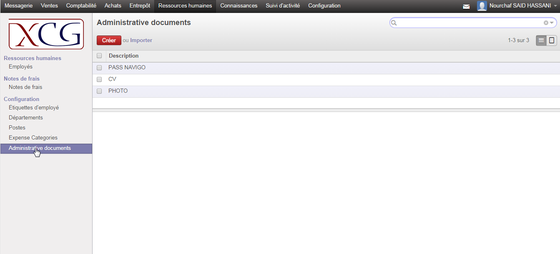
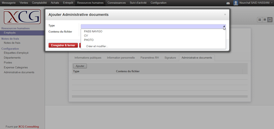
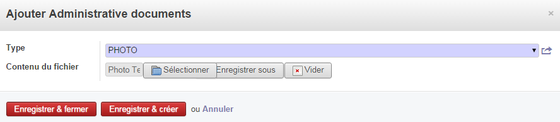

### README ###

### Enchancements to Odoo/OpenERP to manage kinds of attachments. ###

* Attachments can be linked with Odoo/OpenERP objects.

### Main Improvments ###

* Define menus and actions should you want to allow changing document types.
	- For Example, you can attached a new document to an employee:
	*Create type of document
	
	
	*Add
	
	
	* Upload
	
 
* Document attachments are displayed in a many2many field.

* All Document attachments are tracked in Knowledge Menu.

